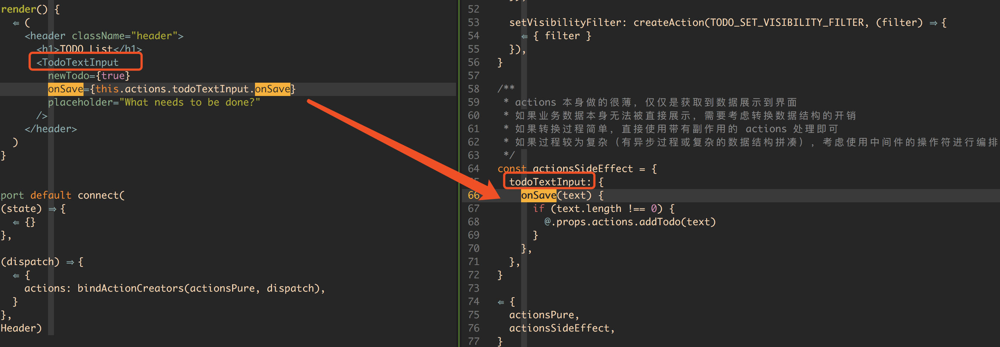
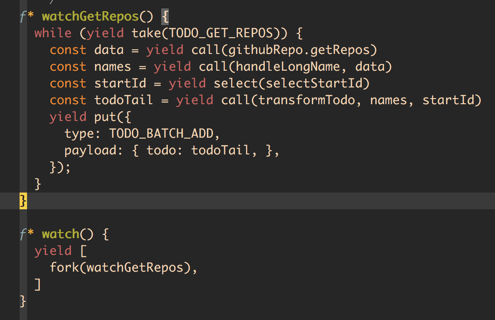

# 结构

参考提供的 [Demo TodoMVC](https://github.com/L-Jovi/exer-web/tree/master/react-practice) 示例，项目的外层结构如下所示。

```
.
├── components
│   ├── Link.js
│   ├── TodoItem.js
│   ├── TodoTextInput.js
│   └── TodoTextInput.spec.js
├── index.js
├── modules
│   ├── actions
│   │   ├── index.js
│   │   ├── index.spec.js
│   │   ├── todo.js
│   │   └── utils.js
│   ├── constants.js
│   ├── index.js
│   ├── reducers
│   │   ├── index.js
│   │   ├── routing.js
│   │   ├── todo.js
│   │   ├── todo.spec.js
│   │   └── visibilityFilter.js
│   ├── sagas
│   │   ├── index.js
│   │   └── todo.js
│   ├── selectors
│   │   └── index.js
│   └── store.js
├── routes.js
├── services
└── views
    ├── App.js
    ├── Footer.js
    ├── MainSection.js
    ├── TodoHeader.js
    └── TodoList.js
```

结构主体沿用标准的 React + Redux，并整合了框架层的行为标准，参考 [ducks-modular-redux](https://github.com/erikras/ducks-modular-redux) 的建议规范。

## 处理

相较一般流程，所作的额外处理只有三处。

1. 进一步抽象 actions 为 pure actions 和 side effect actions，参考 `modules/actions/todo.js`。

  

  这样做的目的是界定 UI 相关的逻辑行为和交互行为，其中 pure actions 所作的事情变得单一，仅仅是引导 reducer 更新状态或与中间件建立连接。

2. 依赖操作符处理复杂场景

  异步场景中，使用 es6 支持的 promise 或者 es7 支持的 async/await 处理排序固然是方便的，但是某些场景中（比如密集的交互触发 http 请求、去抖动，或者等待 timeout 和请求返回结果的竞争首选触发），需要更加符合一般业务场景下的操作符去解决。
  
  这里的开源方案推荐有 [ReactiveX/rxjs](https://github.com/ReactiveX/rxjs) 和 [redux-saga](https://github.com/redux-saga/redux-saga)，其中前者相较可以定制操作符，使用场景更加广泛一些。本例中选用 redux-saga。
  
  参考示例代码中关于 saga 的一般场景使用。
  
  
3. 数据结构的优化

  虽然 React 的 virtual diff 已经在大部分场景尽可能为我们处理了 dom 节点更新的开销，但是在实际差异对比的过程中，React 已经假设了我们的每次 re-render 操作都是需要更新界面的，因此框架本身不会对 props 做深度的解析。
  
  这意味着如果我们的 state 是深层嵌套的结构，在发生频繁更新的时候，如果我们不进行深度比较，是无法真正确定是否 `shouldComponentUpdate`，因此，引入 Immutable 可以从引用级别解决比较深层对象的问题。
  
  参考 [react-indepth/using-shouldComponenUpdate](https://developmentarc.gitbooks.io/react-indepth/content/life_cycle/update/using_should_component_update.html)。

